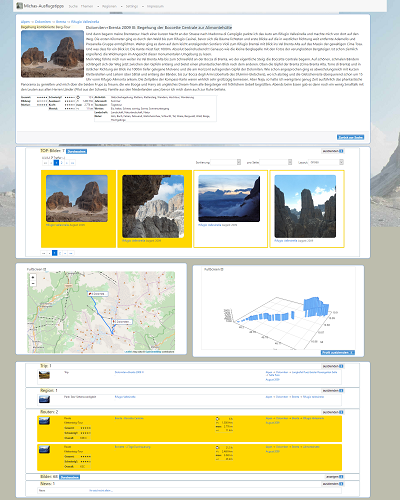

# MyTourBook

MyTourBook is an application for managing and publishing tracks and images from your trips.
It's the software-stack behind the new portal-version [www.michas-ausflugstipps.de](http://www.michas-ausflugstipps.de/mytb/de/). 

For more information take a look at documentation:
- [portalinfo](docs/INFO.md)
- [changelog](docs/CHANGELOG.md) 
- [installation instructions](docs/INSTALL.md)
- [configuration instructions](docs/CONFIGURATION.md)
- [usage instructions](docs/DATAIMPORT.md)
- [administration instructions](docs/ADMIN.md)
- [credits for used libraries](docs/CREDITS.md)

MyTourBook is a reimplementation based on the lessons learned from my old projects for managing and publishing my page [legacy www.michas-ausflugstipps.de](http://www.michas-ausflugstipps.de/index.php)

- mediadb: managing tracks, images and metadata   
- [Mat-ImageImportEditor](https://github.com/das-praktische-schreinerlein/Mat-ImageImportEditor): prepare Imageimports
- [Mat-WebDemo](https://github.com/das-praktische-schreinerlein/Mat-WebDemo): framework behind legacy www.michas-ausflugstipps.de 
- [mat-publishingtools](https://github.com/das-praktische-schreinerlein/mat-publishingtools): tools for printing a book-version

