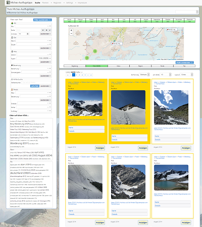

# What is MyTourBook

MyTourBook is a portal for managing tracks, photos and videos from your trips with a bunch of different page types and features:

- starting with sectionpage for different content-sections as startpage, regionPage.... 
- sectionlists to order the sections and give an overview 
- searchpages per section offering a bunch faceting filters and showing results with maps, data and images 
- several actions as edit, delete, merge, tag, rate, playlist and others to manage and filter your trips
- in selectable different layouts as list/small/big/page.... 
- detailpage showing the data and related information of a item 
- possibility to present the searchresults as diashow 
- a startpage with dashboard and job-manager for internal data-management.... 
- a listpage with detected-objects internal data-management.... 
- a editor-page for internal data-management.... 
